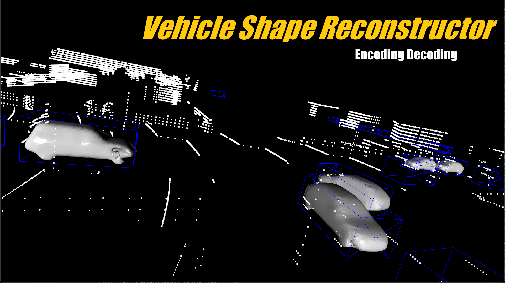
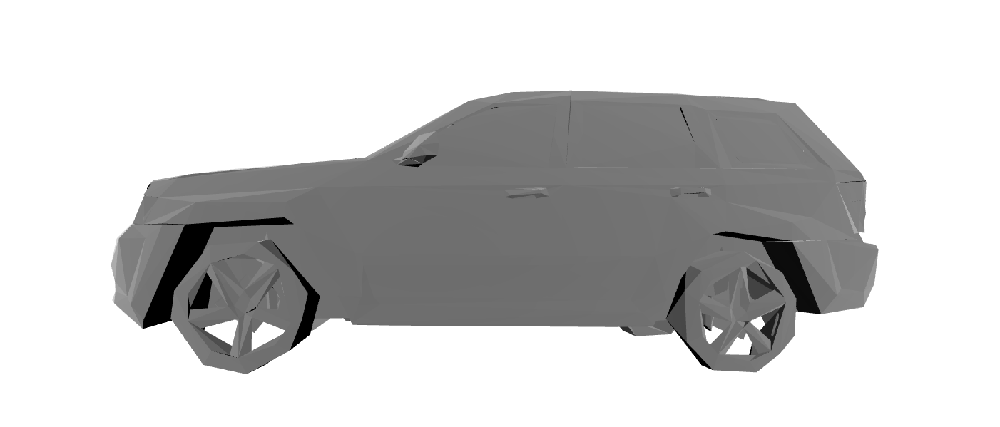
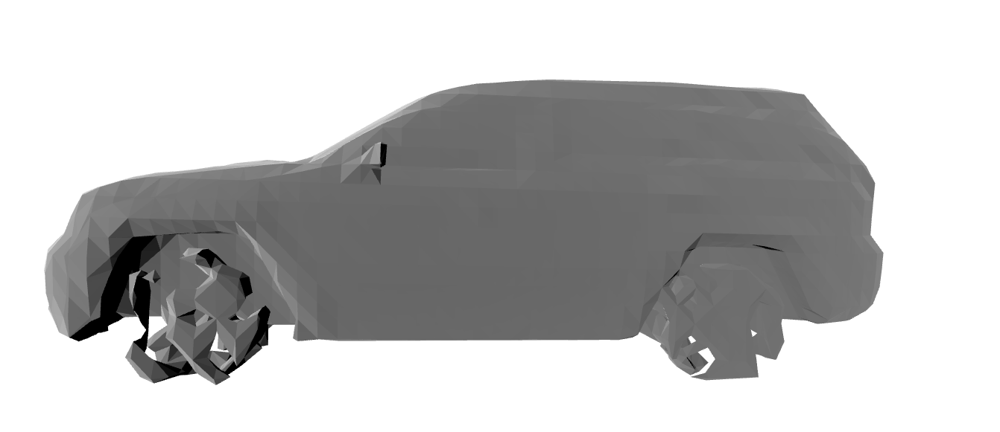
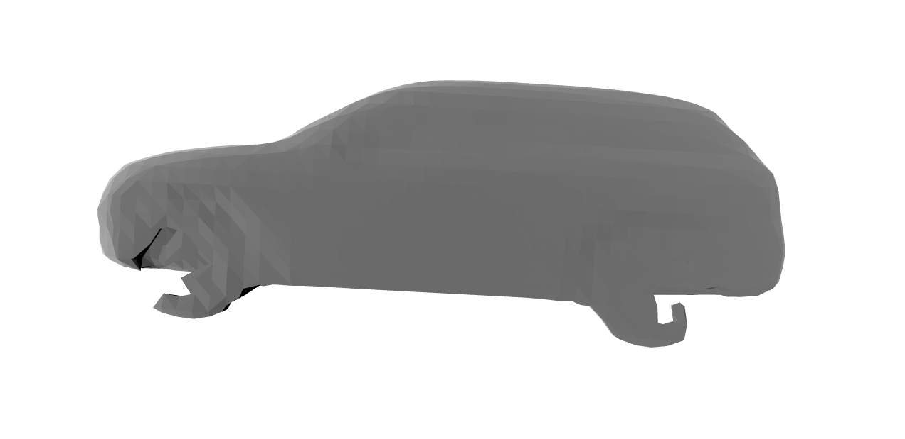
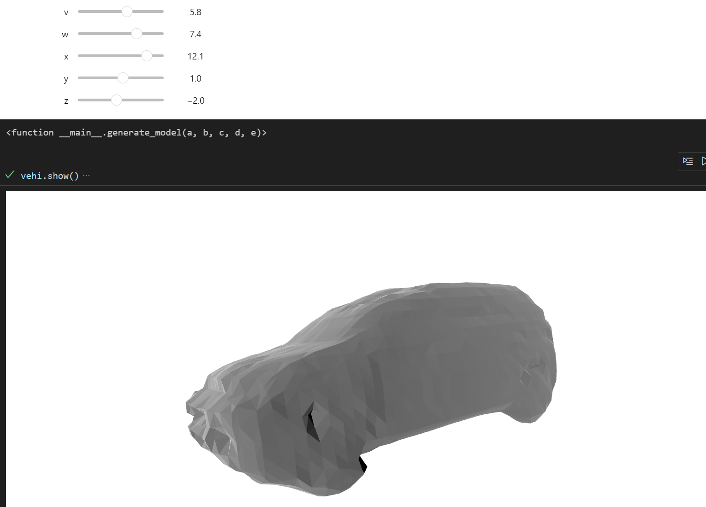

# vehicle-shape-reconstruction

Implementation of tools for reconstruction of vehicle shape.



[TOC]


## Usage

### Vehicle reconstruction







### Vehicles decoding



## Installation

a. Install `trimesh`, `scikit-learn`, `pytorch` properly.

b. Clone this repository.

```bash
git clone git@github.com:Uzukidd/vehicle-shape-reconstruction.git
```

c. Install `mesh_to_sdf` from source.

```bash
cd ./mesh_to_sdf
python ./setup.py develop
```

## Data preprocessing

See details from [data_preprocessing.md](asset\data_preprocessing.md).

## References

Engelmann, Francis, Jörg Stückler, and Bastian Leibe. 2016. “Joint Object Pose Estimation and Shape Reconstruction in Urban Street Scenes Using 3D Shape Priors.” In Lecture Notes in Computer Science,Pattern Recognition, 219–30. doi:10.1007/978-3-319-45886-1_18.

Engelmann, Francis, Jorg Stuckler, and Bastian Leibe. 2017. “SAMP: Shape and Motion Priors for 4D Vehicle Reconstruction.” In 2017 IEEE Winter Conference on Applications of Computer Vision (WACV). doi:10.1109/wacv.2017.51.

[marian42/*mesh_to_sdf*](https://github.com/marian42/mesh_to_sdf)

[open-mmlab/Open*PCDet*](https://github.com/open-mmlab/OpenPCDet)

https://apolloscape.auto/car_instance.html
