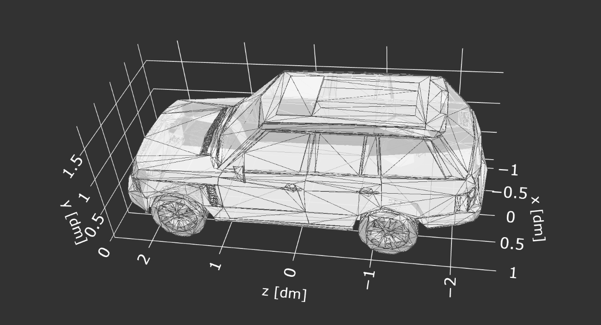
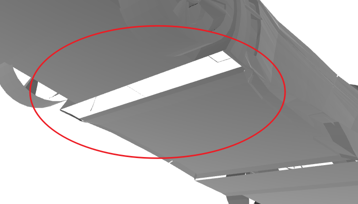
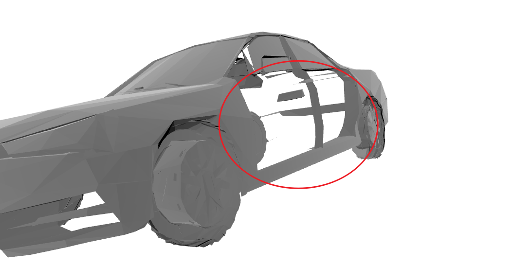
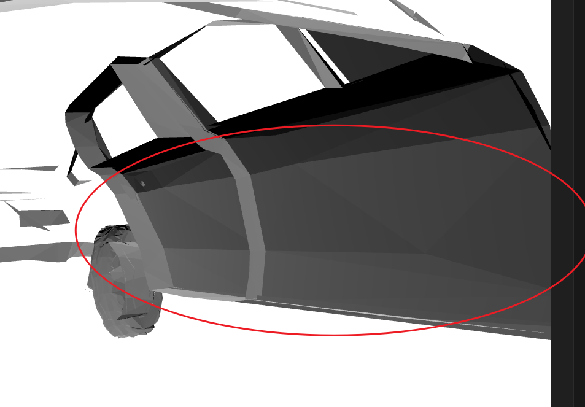

# Data preprocessing

Here, we will provide step-by-step preprocessing for vehicle data.

## Coordinate aligning

As shown in the figure, align the coordinate axes of the vehicle. The front of the vehicle aligns with the positive direction of the z-axis, the left side of the vehicle aligns with the positive direction of the x-axis, and the top of the vehicle aligns with the positive direction of the y-axis.

## Coordinate centering

As shown in the figure, center the vehicle's center at the origin of the x-z coordinate plane, with the wheels just touching the x-z coordinate plane.

## Coordinate scaling

As shown in the figure, scale the units of the vehicle's coordinates to decimeters (dm). 

## Exporting

Finally, export in .obj format.

## Bad data

a. Non-watertight model

b. Model not distinguishing between interior and exterior

